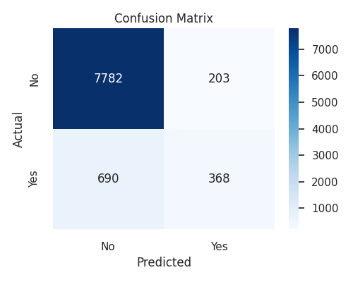
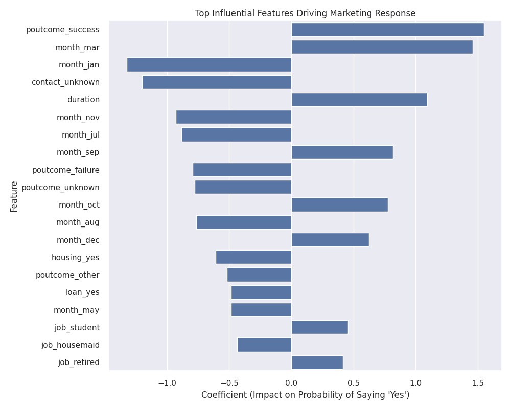
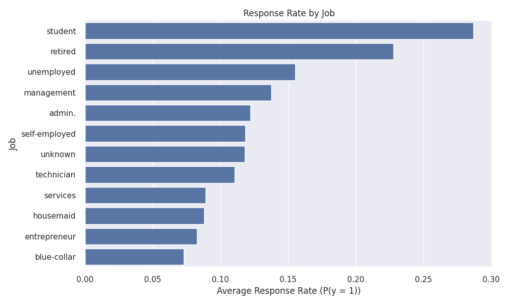
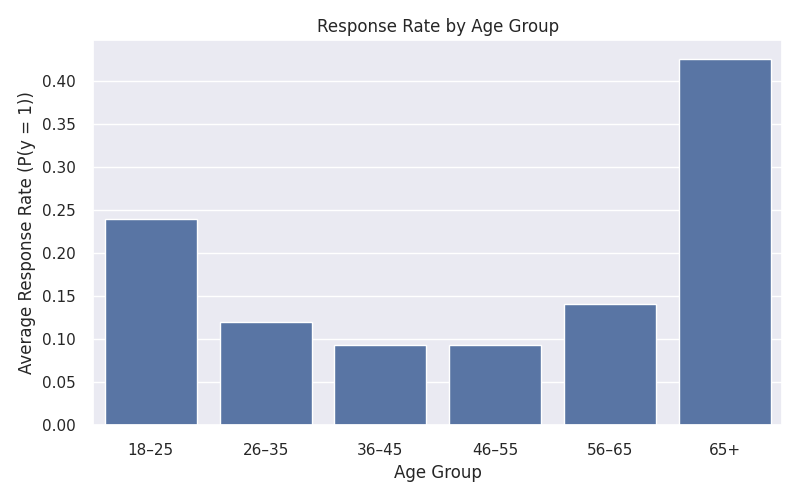

# 📈 Marketing Campaign Response Prediction

This project builds a machine learning classification system that predicts whether a customer will respond **“yes”** to a marketing campaign.  
Using the **Bank Marketing Dataset (UCI)**, the project demonstrates a complete, production-style ML workflow—from raw data preprocessing to model evaluation and business insight generation.

The objective is to help marketing teams **target high-probability customers**, improving campaign efficiency, conversion rates, and overall ROI.

---

## 🔧 Tech Stack

- Python  
- Pandas, NumPy (data cleaning & preprocessing)  
- Matplotlib, Seaborn (visualization)  
- Scikit-learn  
  - Train/Test Split  
  - OneHotEncoder  
  - StandardScaler  
  - Logistic Regression  
  - ColumnTransformer + Pipeline  

---

## 📁 Dataset Overview

The project uses the **Bank Marketing Dataset** from the UCI Machine Learning Repository.  
Each row represents a customer contacted during a direct marketing campaign.

### Key Feature Groups

- **Demographics**: age, job, marital status, education  
- **Financial Variables**: balance, housing loan, personal loan  
- **Contact Information**: contact type, day, month  
- **Campaign History**: duration, campaign, pdays, previous  
- **Economic Indicators**: emp.var.rate, cons.price.idx, euribor3m  
- **Target Variable**:  
  - `y` → customer response  
  - yes = 1, no = 0  

---

## 🤖 Machine Learning Approach

### Preprocessing

- Standardized numerical features  
- One-hot encoded categorical variables  
- Built a unified **ColumnTransformer + Pipeline** for clean, reproducible modeling  

### Model

- **Logistic Regression** (`max_iter = 1000`)  
- Trained on **80%** of the dataset  
- Evaluated on held-out test data  

This setup mirrors real-world ML pipelines used in marketing analytics teams.

---

## 📊 Key Visualizations

These plots summarize both **model performance** and **customer behavior insights**.

### Confusion Matrix

Evaluates how well the model distinguishes responders vs non-responders.

---

### Top Influential Features

Shows which features most strongly increase or decrease the probability of a positive response.

---

### Response Rate by Job

Certain occupations respond to marketing campaigns at significantly higher rates.

---

### Response Rate by Age Group

Visualizes how likelihood of response changes across age ranges.

---

## 🧠 Project Workflow

1. Load and clean the dataset  
2. Encode categorical variables  
3. Scale numerical features  
4. Build ML pipeline  
5. Train logistic regression model  
6. Evaluate model performance  
7. Analyze feature importance  
8. Generate marketing insights  
9. Produce visualizations  
10. Package results for GitHub  

---

## 📌 Insights & Interpretation

This model reveals several actionable marketing trends:

- Certain job categories (e.g., students, retired customers) show significantly higher response rates  
- Longer previous call durations strongly correlate with acceptance  
- Economic indicators impact campaign success  
- Specific age groups are consistently more receptive  

These insights allow marketers to **focus outreach on high-probability customers**, reducing campaign costs and improving conversion efficiency.

---

## 🚀 Future Improvements

- Add Random Forest and XGBoost for performance comparison  
- Build a probability-based targeting dashboard  
- Implement SHAP for deeper model explainability  
- Deploy the model as an API for real-time campaign scoring  

---

## 📁 Project Files

marketing_campaign_response_prediction.ipynb  
bank-full[1].csv  
plots/  
  confusion_matrix[1].png  
  feature_importance[1].png  
  response_by_job[1].png  
  response_by_age_group[1].png
